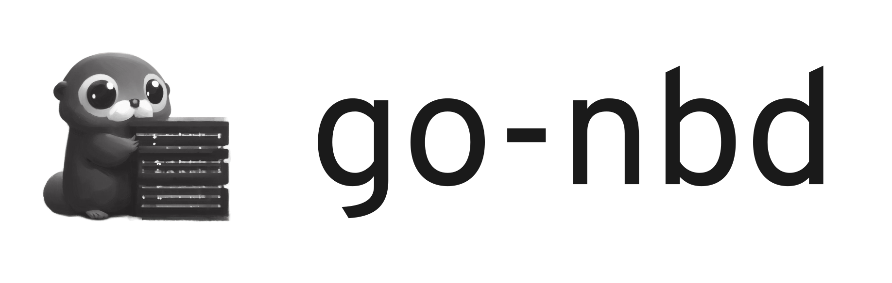

# go-nbd



Pure Go NBD server and client library.

[](https://github.com/pojntfx/go-nbd/actions/workflows/hydrun.yaml)

[](https://pkg.go.dev/github.com/pojntfx/go-nbd)
[](https://matrix.to/#/#go-nbd:matrix.org?via=matrix.org)

## Overview

go-nbd is a lean NBD server and client library supporting the baseline protocol.

It enables you to ...

- **Build NBD servers and clients in Go:** Develop Network Block Device servers and clients using the efficient and easy-to-understand Go programming language, without having to fallback to CGo.
- **Expose any `io.ReadWriter` as a block device:** Effortlessly turn a file, byte slice, S3 bucket or other `io.ReadWriter` into a fully-fledged block device.
- **Bridge with legacy services:** If you need to make your application's dynamic data available to a legacy system, providing a NBD interface can be the perfect solution.

## Installation

You can add go-nbd to your Go project by running the following:

```shell
$ go get github.com/pojntfx/go-nbd/...@latest
```

## Usage

> TL;DR: Define a backend, expose it with a server, connect a block device with the client and setup/mount the filesystem.

### 1. Define a Backend

First, define a backend; it should conform to this simple interface:

```go
type Backend interface {
	ReadAt(p []byte, off int64) (n int, err error)
	WriteAt(p []byte, off int64) (n int, err error)
	Size() (int64, error)
	Sync() error
}
```

A simple file-based backend could look like this:

```go
// server/main.go

type FileBackend struct {
	file *os.File
	lock sync.RWMutex
}

func NewFileBackend(file *os.File) *FileBackend {
	return &FileBackend{file, sync.RWMutex{}}
}

func (b *FileBackend) ReadAt(p []byte, off int64) (n int, err error) {
	b.lock.RLock()

	n, err = b.file.ReadAt(p, off)

	b.lock.RUnlock()

	return
}

func (b *FileBackend) WriteAt(p []byte, off int64) (n int, err error) {
	b.lock.Lock()

	n, err = b.file.WriteAt(p, off)

	b.lock.Unlock()

	return
}

func (b *FileBackend) Size() (int64, error) {
	stat, err := b.file.Stat()
	if err != nil {
		return -1, err
	}

	return stat.Size(), nil
}

func (b *FileBackend) Sync() error {
	return b.file.Sync()
}
```

See [pkg/backend](./pkg/backend) for more backend examples.

### 2. Expose the Backend With a Server

Next, create the backend and expose it with a server:

```go
// server/main.go

b := NewFileBackend(f)

for {
	conn, err := l.Accept()
	if err != nil {
		continue
	}

	go func() {
		if err := server.Handle(
			conn,
			[]server.Export{
				{
					Name:        *name,
					Description: *description,
					Backend:     b,
				},
			},
			&server.Options{
				ReadOnly:           *readOnly,
				MinimumBlockSize:   uint32(*minimumBlockSize),
				PreferredBlockSize: uint32(*preferredBlockSize),
				MaximumBlockSize:   uint32(*maximumBlockSize),
			}); err != nil {
			panic(err)
		}
	}()
}
```

See [cmd/go-nbd-example-server-file/main.go](./cmd/go-nbd-example-server-file/main.go) for the full example.

### 3. Connect to the Server with a Client

In a new `main` package, connect to the server by creating a client; note that you'll have to `modprobe nbd` and run the command as `root`:

```go
// client/main.go

if err := client.Connect(conn, f, &client.Options{
	ExportName: *name,
	BlockSize:  uint32(*blockSize),
}); err != nil {
	panic(err)
}
```

See [cmd/go-nbd-example-client/main.go](./cmd/go-nbd-example-client/main.go) for the full example.

### 4. Setup and Mount the Filesystem

Lastly, create a filesystem on the block device and mount it:

```shell
$ sudo mkfs.ext4 /dev/nbd0
$ sudo mkdir -p /mnt
$ sudo mount -t ext4 /dev/nbd0 /mnt
```

You should now be able to use the mounted filesystem by navigating to `/mnt`.

🚀 That's it! We can't wait to see what you're going to build with go-nbd.

## Examples

To make getting started with go-nbd easier, take a look at the following examples:

- [NBD File Server](./cmd/go-nbd-example-server-file/main.go)
- [NBD Memory Server](./cmd/go-nbd-example-server-memory/main.go)
- [NBD Client](./cmd/go-nbd-example-client/main.go)

## Acknowledgements

- [abligh/gonbdserver](https://github.com/abligh/gonbdserver/) provided the initial inspiration for this project.
- [NetworkBlockDevice/nbd](https://github.com/NetworkBlockDevice/nbd/blob/master/doc/proto.md) provided the NBD protocol documentation.

## Contributing

To contribute, please use the [GitHub flow](https://guides.github.com/introduction/flow/) and follow our [Code of Conduct](./CODE_OF_CONDUCT.md).

To build and start a development version of one of the examples locally, run the following:

```shell
$ git clone https://github.com/pojntfx/go-nbd.git
$ cd go-nbd
$ rm -f disk.img && truncate -s 10G disk.img && go run ./cmd/go-nbd-example-server-file .
$ go run ./cmd/go-nbd-example-server-memory .

# With the C NBD client
$ sudo umount ~/Downloads/mnt; sudo nbd-client -d /dev/nbd1 && echo 'NBD starting' | sudo tee /dev/kmsg && sudo nbd-client -N default localhost 10809 /dev/nbd1

# With the Go NBD client
$ sudo umount ~/Downloads/mnt; go build -o /tmp/go-nbd-example-client ./cmd/go-nbd-example-client/ && sudo /tmp/go-nbd-example-client --file /dev/nbd1

$ sudo mkfs.ext4 /dev/nbd1
$ sync -f ~/Downloads/mnt; sudo umount ~/Downloads/mnt; sudo rm -rf ~/Downloads/mnt && sudo mkdir -p ~/Downloads/mnt && sudo mount -t ext4 /dev/nbd1 ~/Downloads/mnt && sudo chown -R "${USER}" ~/Downloads/mnt
```

Have any questions or need help? Chat with us [on Matrix](https://matrix.to/#/#go-nbd:matrix.org?via=matrix.org)!

## License

go-nbd (c) 2023 Felicitas Pojtinger and contributors

SPDX-License-Identifier: Apache-2.0
